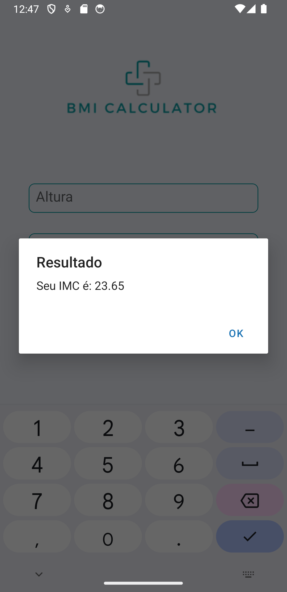

# Calculadora IMC

Este é um aplicativo simples em React Native e JavaScript que calcula o Índice de Massa Corporal (IMC) com base na altura e peso inseridos pelo usuário.

## Capturas de Tela

<div style="display: flex;">
    
    
    
</div>

## Funcionalidades

- Calculadora de IMC: Insira sua altura e peso para calcular seu IMC.
- Validação: Verificação para garantir que os valores de altura e peso sejam válidos antes de calcular.
- Tela de Carregamento: Uma tela inicial de carregamento é exibida enquanto o aplicativo é inicializado.

## Instalação

Para clonar e executar este aplicativo, você precisará do [Git](https://git-scm.com), [Node.js](https://nodejs.org/en/), e [Expo CLI](https://docs.expo.dev/get-started/installation/) instalados em seu computador. A partir da linha de comando:

```bash
# Clone este repositório
$ git clone https://github.com/devraulbraga/app_calculadora_imc

# Acesse a pasta do projeto
$ cd app_calculadora_imc

# Instale as dependências
$ npm install

# Inicie o projeto
$ npx expo start

```
## Licença

Este projeto está licenciado sob a MIT License.
